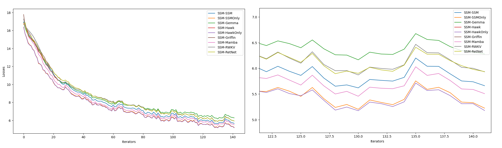
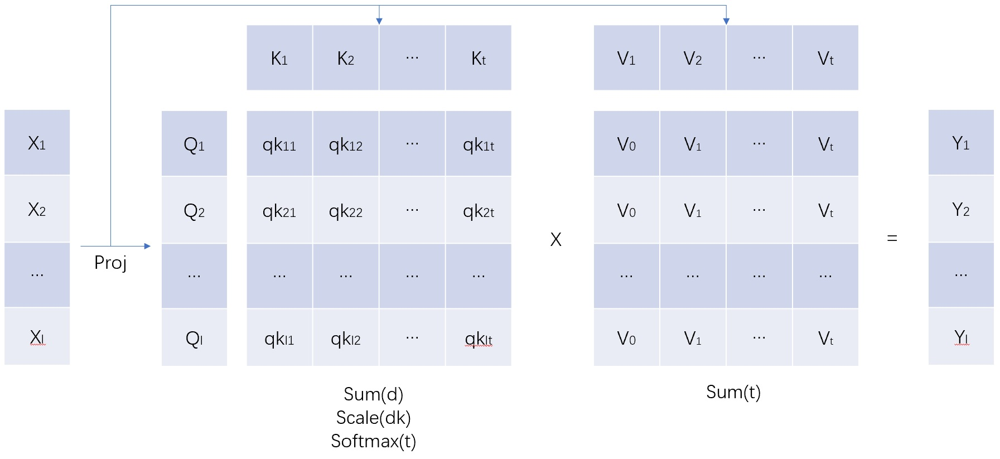
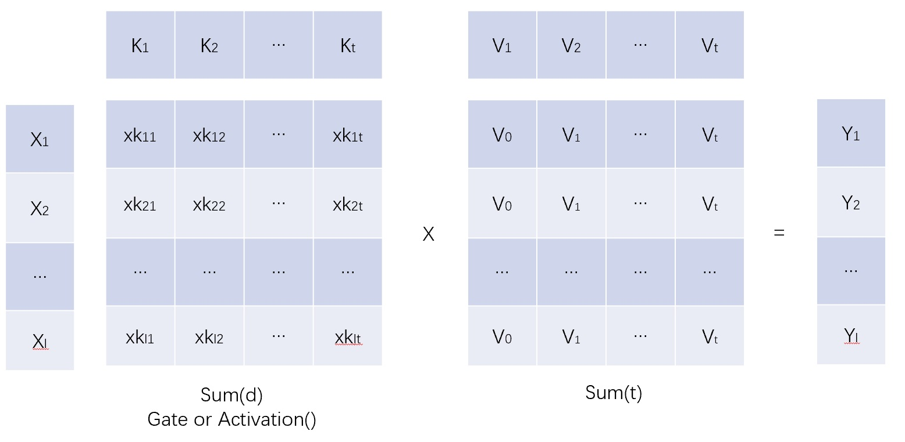
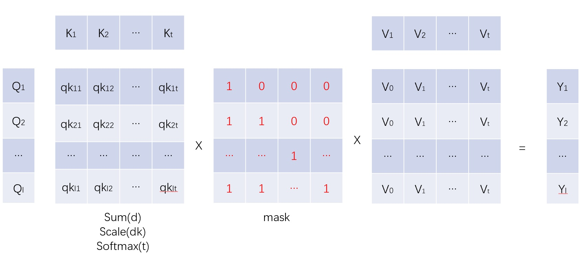
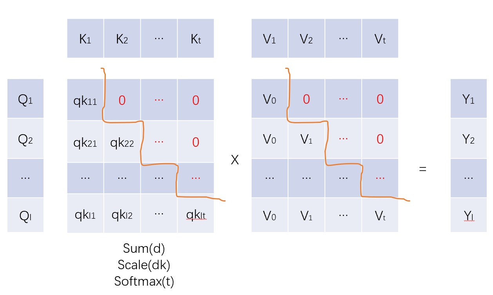
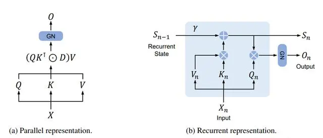
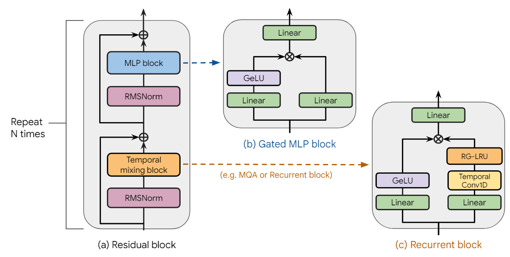
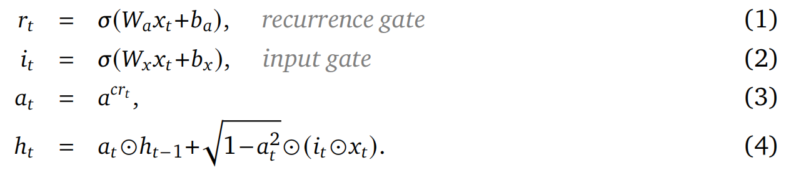

# GPTWave
[中文](README_zh.md)

A envirenment to learn those GPTs all in theory and practice. This is not a basic introduction about GPTs, I just try to summarize the key point in most of models and understanding it need some backgroud knowledges. 

## A typical training result is sth like this below

>>python SSM.py



Players:

1. Gemma
2. Mamba
3. Griffin
4. RetNet
5. Hawk
6. RWKV
7. SSM(by myself)

I just try to keep the same parameters with all players and the same architecture to orginal Paper.

## Unstanding all GTPs

There's too many players and hard to understand all of them. But what's the key of all players?

### Solve it in a high-dimension way

In fact, solving problem in high dimension is the key of all players. The high dimension are 4、5... etc.

The basic high dimension element is vector(an array of value, 1-dimension). We alwayse use 1 dimension vector to repesent a word、a class of sth, a patch of picture、a pixel of picture、..... because one value is not enough to contain those informations.

And so on, we can repesent sentence、picture、.... in a 2-dimension vector.

And 3-dimension to a movie ..... ? How about 4、5、6 dimension vector? Don't worry, we don't need to unstandent it all. Just use it to solve problems. Let's begin at the most popular architecture Attention.

## Attention in Transformer

A typical attention architecture is below:



This looks a little complex-mixing of matmul、element-wise mul. So let us redefine the n-dimension tensor algorithm into two meta algorithm: mul and sum(In fact, this is the einsum implementation).

1. Y = mul(A, B)
   1. The Y dimentions are all dimensions exist in A and B.
   2. All dimensions will be appended to A and B if which is not in A and B.
   3. All dimensions in A and B will expand(repeat) to the same dimension-size to the result.
   4. Do element-wise mul between A and B
2. Y = sum(x, y-dims)
   1. sum all x dimensions which is not in y-dims

Examples:

1. mul(A(i,j), B(j,k)) = C(i,j,k)
2. mul(A(l,m,n), B(i,j,k)) = C(l,m,n,i,j,k)

Let's look into the previous basic algorithm of matmul, element-wise mul, bmm.....

1. matmal(A(i,j), B(j,k)) = sum( mul(A(i,j), B(j,k)), 'i,k') = C(i,k)
2. element-wise mul is a special mul : the two tensor must have the same dimension definion.
3. bmm(A(b,i,j), B(b,j,k)) = sum( mul(A(b,i,j), B(b,j,k)), 'b,i,k') = C(b,i,k)
4. ......

So. mul and sum are the two basic algorithm of n-dimsion algorithm. And the most iimportant point is: it is order free. Let's define: einsum = sum(mul(A,B,...)). There will be:  einsum(Q,K,V)=einsum(K,V,Q)=einsum(V,Q,K)

Ok, what about attention?

Attention(Q,K,V) = einsum(softmax(einsum(Q,K)), V)

If we ignore softmax part. The formula will be looks like:

```
Attention(Q, K, V) = einsum(Q,K,V)      # order free
Q = Q(b,l,dqk)
K = K(b,t,dqk)
V = V(b,l,d)
b -- Batch size
l -- Sentence size
t -- Sentence size but diff to l(First up dimension)
dqk -- The dimension size of Q, K(Second up dimension)
```

Please look into this importent formula again and again.

1. Attention is just seperating into two einsum, einsun(Q,K) first and einsum(softmax(QK),V) next.
2. There are two upgrade dimension: dqk and t.
3. t is the same size to l but means that every result is a sum of all input. This is Attention key.
4. dqk is alwayse the same size to d in practice but means that every result C is a sum of a new generated dimension: dqk. (In fact, dqk can be diff to d).

How about softmax in Attention? In fact, softmax gave us the things below:

1. Benifit: Make sure the result will not be too large or too small. sum and mul Q,K first and softmax it will convert it to a weight of V.
2. Weak point: einsum(Q,K) first will generate LxL matrix, that means a O(l)**2 complexcity.

Another issue is: We sum all value to result, how about the diff of each position of word? Haha, in fact, we can add a learnable bias to Q and K. This is the reason we need position embedding. 

Summary: Attention is a way to solve 3-dimension(Batch, Length of sentence, Dimension of word -- B,L,D) probelms in a 5-dimension way -- adding 2-dimension t(Time of word or sequence of word), dqk(query and key dim to caculate the relevance between words).

How about FFn and other Blocks? In fact, similar

## FFN and MLP

A typical FFN and MLP block is like:



The diff to Attention is:

1. K, V are a leanable parameters and not be projected from x.
2. Input X was treated as Q directlly.
3. Softmax in Attention was replaced to activation(silu/gelu) or Gate way in practice. (In fact, maybe softmax、activation like gelu/silu、gate are the same target but diff ways).

That's all of FFN and MLP. So, if you know Attention above deeply. FFN is easy to be understand.

What's next? Linear Transformer、AFT、RetNet、RWKV、Mamba、SSM...

## Linear Transformer

The linear transformer formula:

$$ Y = einsum(einsum(∅(Q), ∅(K)), V) == einsum(∅(Q), einsum(∅(K), V)) $$

In this practice:

1. The length dimention will be sum(reduced) in einsum(∅(K),V) first.
2. ∅(Q), ∅(K) first to keep value to be stable.

That's all. Without $L*L$ QK matrix but $D*D$ KV matrix. If $D < L$, it's valuable things.

## Attention Free Transformer

The AFT formula:

$$ Y = ∅(Q) * einsum(exp(W), exp(K) * V) / sum(exp(W), exp(K)) $$

In this practice:

1. Add a leanable bias W to represent position. The W dimension is:[l, t]. It's also $L*L$ but without batch dimension.
2. Another softmax way on KV. This means taking K+W as weight of V.
3. ∅(Q) is a gate to Y(element-wise mul). It was called by Q and also can be called by G(means Gate).
4. The limitations are: W is a $$ L*L $$ matrix and the dimension K should be the same to V.

The AFT is a cool implementaion to keep it more simple.

At here, where is GPT? Let's take into a causal way first.

## What is GPT?

GPT-Generative Pre-training Tranformer. Generative means every word in the output is generated by the previous word in the sentence. It means that it can't be related to the next word in the sentence.

How to realize it in Attention? In fact, just mask out(set to zero) the word followed by itself.

Masked Attention(Q,K,mask,V) = einsum(sofftmax(Q,K), mask, V)



After introducing mask matrix in Attention, the original Attention will be like:



1. Every output Y(i) is relatived to V(0) ~ V(i), the V(i+1)... is masked out for Y(i).
2. (Nothing more...)

In fact, generative means introduce a mask matrix in einsum in all GPTs. We also call GPT as causal language model because the previous words are the reason of those words next.

At here, we must say that attention is a cool solution to causal language model. But there are still some weak point:

1. Attention scope is limit to L(sentence length). We can't generate word which is out of attention scope. Attention has no memory to generate anything. That means, if we want to do this, we need enlarge the attention scope(L).
2. After enlarging L. The complexity of training will be a big problem, because the QK matrix size is $B*L*L$. It's too heavy at here if L is too large.

## Parallel-RNN is a possiable way to have memories

The traditional RNN is just adding a vector H to represent and compress the history informations. The biggest problem is the training performace. It's hard to training a RNN in a parallelized way. A typical RNN formula is like:

$$ h(n) = a(n)*h(n-1)+b(n) $$

If we want to caculate h(n), we must caculate h(n-1) first. This is a recurrent way and hard to parallel traing. But, really? We know that causal way can mask out the future info for current value. But this is not enough.

Again, solve it in a high-dimension way and einsum is alwayse working for it. There's too many formulas to caculate it. So, let's ignore it here, but the point is, we can do it.

Next, I will introduce some cool implementation on this and also will ignore the parallel part in it.

## RetNet

The RetNet is:



$$S(n) = λ * S(n-1) + einsum(K(n),V(n))$$
$$Y(n) = einsum(Q(n), S(n))$$

Please ignore the left part in the graph. The point is:

1. S is the memory block from KV.
2. The dimention of K is dk, The dimention of V is dv. The dimention of KV is (dk,dv). Formula: KV(n) = einsum(K(n),V(n)) = einsum('dk, dv->dkv', K(n), V(n)).
3. There is a leaning decay ration λ to S every time.
4. And then, parallized the training:)

## Mamba

There's many details in mamba implementation, but the core is SSM part. The formula like:

$$S(n) = A(n)*S(n-1)+B(n)*X(n)$$
$$Y(n) = C(n)*S(n)+D(n)$$
$$A(n) = einsum(decay, Δ(n))$$
$$B(n) = einsum(proj_B(x), Δ(n))$$
$$C(n) = proj_C(x)$$
$$Δ(n) = softmax(proj_{Δ}(proj_{dtrank}(x)))$$

The key point is:

1. It's a element-wise operation in the formula.
2. A(n), B(n), C(n) are all related to input x. That means selective feature.
3. A(n) is alse combined leanable decay parameters.
4. In practice, mamba invited a Δ vector to influence A(n), B(n) and the Δ is a FFN(x).
5. And then, parallized the training:)

There are many details i havent' mentioned yet. Find it in orginal paper if you want.

## Hawk

The full picture of Hawk is:


Hawk is very simular to GRU. The recurrent formula(LG_LRU) is:



In hawk:

1. y(t) = output(h(t)). I like this part most. It's quite simpler than other implementations such as: RetNet/Mamba/RWKV etc. Simpler is better.
2. Conv is the same to mamba and simular to RWKV(conv_kernel_size=2 in RWKV).
3. MLP block is same to Gemma or simular to LLaMA.
4. A gate to h(n) in Attention block.

## Parallelize RNNs above

We focus on typical RNN formula:

$$ s(n) = a(n)*s(n-1)+b(n) $$

Then:

```
Parallel-RNN formula:
s(1) = a(1) * s(0) + b(1)
s(2) = a(1) * a(2) * s(0) + a(2)*b(1) + b(2)
s(n) = a(n) * s(n-1) + b(n)
     = a(1) *...* a(n) * s(0) + a(2) *...*a(n) * b(1) + .... + a(n-1) * b(n-1) + b(n)
cuma = [a(1), a(1) * a(2), ..., a(1)*...*a(n)] = np.cumprod(a)
shifta = [ 1., cuma(1), cuma(2), ...., cuma(n-1)] = 
shiftb = [ s(0), b(1), ..., b(n-1)]
s(n) = cuma(n) * ( shiftb(1) / shifta(1) + shiftb(2) / shifta(2) + .... + shiftb(n) / shifta(n)) + b(n)
```

Finally:
$$S = einsum(cuma, mask, shiftb/shifta) + B$$

In practice, if the S size is too large(such as RetNet - $d_k*d_v$, Mamba -$d_{state}*d_v$), We can also try to optimaize it like this below.

```
For formula:
S(n) = a(n) * S(n-1) + b(n)
y(n) = einsum(C(n), S(n))

We can have:
Y =     einsum(C, cuma[:,1:], mask[:,1:], shiftb[1:]/shifta[1:]) +
        einsum(C, cuma[:,0], S0) +
        einsum(C, B(x))
S(n) =  einsum(cuma[:,0], S0) + 
        einsum(cuma[-1,1:], shiftb[1:]/shifta[1:]) +
        b(n)
```

A little bit complex here and most Parallel-RNN kernel was written in to CUDA kernel. Maybe the pytorch or tensorflow should do this later.

In my env, I have already implemented it by torch without CUDA kernel. So, all samples can be run on CPU(In fact, I haven't test on CUDA yet).

## Finally

All RNN implementaion weak point is: The memory will loss information gradually faster or slower. There's no one implementation can enforce the memory for now. That mean, whatever how important it is, It will be forgotten later. This is the point what i'm thinking. Is it possiable to caculate b(n) by S(n) and X(n) not only by X(n) for now?

Thinking .......
