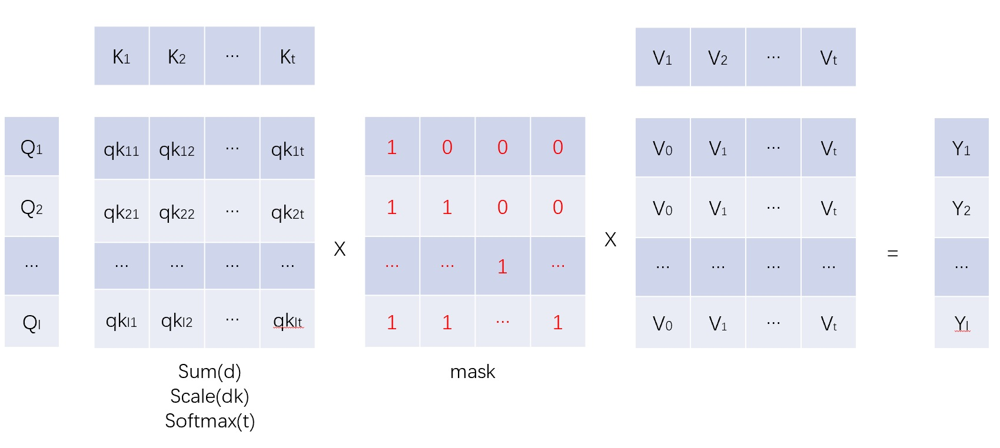

# GPTWave

一个学习一些主流GPT技术的环境，这不是一个基础的普及的说明，里面有些元素，需要有一定的背景知识，我只是试图将这些知识归纳一下。

## 典型的运行过程和结果如下

>>python SSM.py


对比模型包括:

1. Gemma
2. Mamba
3. Griffin
4. RetNet
5. Hawk
6. RWKV
7. SSM(by myself)

我只是尝试与所有模型保持相同的参数以及与原始论文相同的架构。

## 如果理解这些GPTs

模型太多了，很难全部了解。但所有模型的关键是什么？

### 用提升维度的方法解决问题

事实上，解决问题是关键就是提升维度。高维有4、5...等。

基本的高维元素是向量（值数组，一维）。我们总是用一维向量来表示一个单词、一类东西、一张图片、图片的一个像素……因为一个值不足以包含这些信息。

诸如此类，我们可以用二维向量来表示句子、图片、……。

还有 3 维电影......？ 4、5、6维向量怎么样？别担心，我们不需要忍受这一切。只是用它来解决问题。让我们从最流行的架构Attention开始。

## Attention in Transformer

一个典型的注意力架构如下:


这看起来有点复杂，一系列matmul、element-wise mul的混合。那么让我们将n维张量算法重新定义为两个元算法：mul和sum（其实这就是einsum的实现）.

1. Y = mul(A, B) -- (其实就是pytorch里面的逻辑)
   1. Y的维度是 A 和 B 中存在的所有维度。
   2. 如果维度在 A 和 B 中没有，则所有维度将附加到 A 和 B。
   3. A 和 B 中的所有维度将扩展（重复）到与结果相同的维度大小。
   4. 在 A 和 B 之间进行元素级乘法
2. Y = sum(x, y-dims)
   1. 对不在y-dims维度中所得的x的维度求和

例如:

1. mul(A(i,j), B(j,k)) = C(i,j,k)
2. mul(A(l,m,n), B(i,j,k)) = C(l,m,n,i,j,k)

我们来看看之前的matmul基本算法：matmul, element-wise mul, bmm.....

1. matmal(A(i,j), B(j,k)) = sum( mul(A(i,j), B(j,k)), 'i,k') = C(i,k)
2. element-wise mul 是一种特殊的乘法 ：两个张量必须具有相同的维度定义。
3. bmm(A(b,i,j), B(b,j,k)) = sum( mul(A(b,i,j), B(b,j,k)), 'b,i,k') = C(b,i,k)
4. ......

所以。 mul和sum是n维算法的两个基本算法。最重要的一点是：它是免费的。让我们定义：einsum = sum(mul(A,B,...))。将有： einsum(Q,K,V)=einsum(K,V,Q)=einsum(V,Q,K)

好吧，Attention呢？

Attention(Q,K,V) = einsum(softmax(einsum(Q,K)), V)

如果我们忽略softmax部分。公式如下：

```
Attention(Q, K, V) = einsum(Q,K,V)      # order free
Q = Q(b,l,dqk)
K = K(b,t,dqk)
V = V(b,l,d)
b -- Batch size
l -- Sentence size
t -- Sentence size but diff to l(First up dimension)
dqk -- The dimension size of Q, K(Second up dimension)
```

请反复研究这个重要的公式

1. Attention 只是分成两个 einsum，首先是 einsum(Q,K)，然后是 einsum(softmax(QK),V)。
2. 升级维度有两个：dqk和t。
3. t 与 l 大小相同，但意味着每个结果都是所有输入的总和。这是注意键。
4. 实际上，dqk 始终与 d 大小相同，但这意味着每个结果 C 都是新生成的维度 dqk 的总和。 （事实上​​，dqk 可以 diff 到 d）。

Attention中的softmax是啥作用？事实上，softmax特点如下：

1. 好处：确保结果不会太大或太小。 sum 和 mul Q,K 首先和 softmax 它将把它转换成 V 的权重。
2. 弱点：einsum(Q,K) 首先会生成 LxL 矩阵，这意味着 O(l)**2 复杂度。

另一个问题是：我们将所有值相加得到结果，那么单词每个位置的差异怎么样？哈哈，其实我们可以给Q和K添加一个可学习的偏置，这就是我们需要位置嵌入的原因。

总结：Attention 是一种以 5 维方式解决 3 维（Batch、句子长度、单词维度——B、L、D）问题的方法——添加 2 维 t（单词或序列的时间） word），dqk（查询和键暗淡计算单词之间的相关性）。

FFN和其它模块呢？其实类似

## FFN and MLP

一个典型的 FFN 和 MLP 块如下:


与 Attention 的区别是:

1. K、V 是可学习的参数，而不是从 x 投影过来。
2. 输入X直接被视为Q。
3. Attention中的Softmax在实践中被替换为激活（silu/gelu）或Gate方式。 （事实上​​，也许像gelu/silu、gate这样的softmax、activation是相同的目标，但方式不同）。

这就是 FFN 和 MLP 的全部内容。所以，如果你对上面的Attention了解很深的话。 FFN很容易理解。

下一步是什么？ Linear Transformer、AFT、RetNet、RWKV、Mamba、SSM...

## Linear Transformer

Linear transformer的典型公式如下:

$$ Y = einsum(einsum(∅(Q), ∅(K)), V) == einsum(∅(Q), einsum(∅(K), V)) $$

在本次里面:

1. 长度维度L将首先在 einsum(∅(K),V) 中求和（减少）。
2. ∅(Q)、∅(K)是为了保持数值稳定.

就这样。没有$L*L$ QK 矩阵，但有$D*D$ KV 矩阵。如果$D<L$, 则是有价值的选择。

## Attention Free Transformer

AFT公式如下:

$$ Y = ∅(Q) * einsum(exp(W), exp(K) * V) / sum(exp(W), exp(K)) $$

在这个实现中:

1. 添加可倾斜偏差 W 来表示位置。 W 维度为：[l,t]。这也是$L*L$，但没有批量维度.
2. KV 上的另一种 softmax 方式。这意味着将K+W作为V的权重。
3. ∅(Q) 是 Y(element-wise mul) 的门。它可以被Q调用，也可以被G（Gate的意思）调用。
4. 限制是 W 是一个 $L*L$ 矩阵，并且K和V的维度必须相同（Attention里面不需要这样）。

AFT 是一个很酷的实现，可以让它变得更加简单。

到此，GPT在哪里？让我们首先考虑因果关系。

## 什么是GPT?

GPT-生成式预训练变压器。生成意味着输出中的每个单词都是由句子中的前一个单词生成的。这意味着它不能与句子中的下一个单词相关。

在Attention中如何实现呢？事实上，只需屏蔽（设置为零）后面跟着的单词本身即可。

Masked Attention(Q,K,mask,V) = einsum(sofftmax(Q,K), mask, V)



在Attention中引入mask矩阵后，原来的Attention会是这样的：


1. 每个输出 Y(i) 都与 V(0) ~ V(i) 相关，V(i+1)... 被 Y(i) 屏蔽掉。
2. (Nothing more...)

事实上，生成式方法在所有 GPT 的 einsum 中引入了一个掩码矩阵。我们也将 GPT 称为因果语言模型，因为前面的单词是下一个单词的原因。

在这里，我们必须说注意力是因果语言模型的一个很酷的解决方案。但还有一些缺点：:

1. 注意范围仅限于L（句子长度）。我们无法生成超出注意力范围的单词。注意力没有记忆来产生任何东西。这意味着，如果我们想做到这一点，我们需要扩大注意力范围（L）。
2. 放大L后，训练的复杂度会是一个大问题，因为QK矩阵大小为$B L L$。如果 L 太大，这里就太重了。

## Parallel-RNN is a possiable way to have memories

传统的RNN只是添加一个向量H来表示和压缩历史信息。最大的问题是训练表现。以并行方式训练 RNN 很困难。典型的 RNN 公式如下

$$ h(n) = a(n)*h(n-1)+b(n) $$

如果我们想计算h(n)，我们必须先计算h(n-1)。这是一种循环方式，很难并行训练。但是，真的吗？我们知道因果方式可以掩盖当前值的未来信息。但这还不够。

再次强调，以高维方式解决这个问题，einsum 始终致力于解决这个问题。公式太多，无法计算。所以，我们在这里忽略它，但重点是，我们可以做到。

接下来，我将介绍一些很酷的实现，并且也会忽略其中的并行部分

## RetNet

RetNet如下:


$$S(n) = λ * S(n-1) + einsum(K(n),V(n))$$
$$Y(n) = einsum(Q(n), S(n))$$

请忽略图中左侧部分。重点是：

1. S是KV中的内存块。
2. K 的维数为 dk，V 的维数为 dv。 KV的量纲是(dk,dv)。公式：KV(n) = einsum(K(n),V(n)) = einsum('dk, dv->dkv', K(n), V(n))。
3. 每次都有一个相对于S的倾斜衰减比λ。
4. 然后，并行化训练：）

## Mamba

mamba实现的细节很多，但最核心的是SSM部分。公式如下：

$$S(n) = A(n)*S(n-1)+B(n)*X(n)$$
$$Y(n) = C(n)*S(n)+D(n)$$
$$A(n) = einsum(decay, Δ(n))$$
$$B(n) = einsum(proj_B(x), Δ(n))$$
$$C(n) = proj_C(x)$$
$$Δ(n) = softmax(proj_{Δ}(proj_{dtrank}(x)))$$

关键点是:

1. 这是公式中的逐元素运算。
2. A(n)、B(n)、C(n) 都与输入 x 相关。这意味着选择性特征。
3. A(n) 也是可学习衰减参数的组合。
4. 在实践中，曼巴引入了一个Δ向量来影响A(n)、B(n)，Δ是一个FFN(x)。
5. 然后，并行化训练：）

还有很多细节我还没有提到。如果需要，可以在原始论文中查看。

## Hawk

Hawk的全图是:


Hawk 与 GRU 非常相似。递归公式(LG_LRU)为:


在这个hawk中:

1. y(t) = 输出(h(t))。我最喜欢这一部分。它比其他实现（例如：RetNet/Mamba/RWKV 等）简单得多。越简单越好。
2. Conv与mamba相同，与RWKV类似（RWKV中的conv_kernel_size=2）。
3. MLP 块与 Gemma 相同或与 LLaMA 类似。
4. 门控部分与MLP或Mamba中的门控部分类似。

需要注意的是，在最简单的测试里面，发现不要MLP模块，只用Hawk模块，效果最好，但没经过严格测试。

## 如何并行化运算上面的这些RNNs

我们关注典型的RNN公式:

$$ s(n) = a(n)*s(n-1)+b(n) $$

然后，推导过程（有点复杂）:

```
Parallel-RNN formula:
s(1) = a(1) * s(0) + b(1)
s(2) = a(1) * a(2) * s(0) + a(2)*b(1) + b(2)
s(n) = a(n) * s(n-1) + b(n)
     = a(1) *...* a(n) * s(0) + a(2) *...*a(n) * b(1) + .... + a(n-1) * b(n-1) + b(n)
cuma = [a(1), a(1) * a(2), ..., a(1)*...*a(n)] = np.cumprod(a)
shifta = [ 1., cuma(1), cuma(2), ...., cuma(n-1)] = 
shiftb = [ s(0), b(1), ..., b(n-1)]
s(n) = cuma(n) * ( shiftb(1) / shifta(1) + shiftb(2) / shifta(2) + .... + shiftb(n) / shifta(n)) + b(n)
```

最后: 看吧，都可以划归为升级到高纬度来解决问题
$$S = einsum(cuma, mask, shiftb/shifta) + B$$

在实际事件中，如果状态值太大（类似mamba或RetNet），可能还需要引入一些优化技巧，如下：

```
For formula:
S(n) = a(n) * S(n-1) + b(n)
y(n) = einsum(C(n), S(n))

We can have:
Y =     einsum(C, cuma[:,1:], mask[:,1:], shiftb[1:]/shifta[1:]) +
        einsum(C, cuma[:,0], S0) +
        einsum(C, B(x))
S(n) =  einsum(cuma[:,0], S0) + 
        einsum(cuma[-1,1:], shiftb[1:]/shifta[1:]) +
        b(n)
```

这里有点复杂，大多数 Parallel-RNN 内核被写入 CUDA 内核。也许 pytorch 或 tensorflow 应该稍后执行此操作。

在我的环境中，我已经在没有 CUDA 内核的情况下通过 torch 实现了它。因此，所有示例都可以在CPU上运行（事实上，我还没有在CUDA上进行测试）。

## Finally

所有 RNN 实现的要点是：记忆会逐渐更快或更慢地丢失信息。目前还没有一种实现可以强制执行内存。这意味着，无论它有多重要，以后都会被遗忘。这就是我所想的重点。现在是否可以仅通过 X(n) 来通过 S(n) 和 X(n) 来计算 b(n)？

Thinking .......
